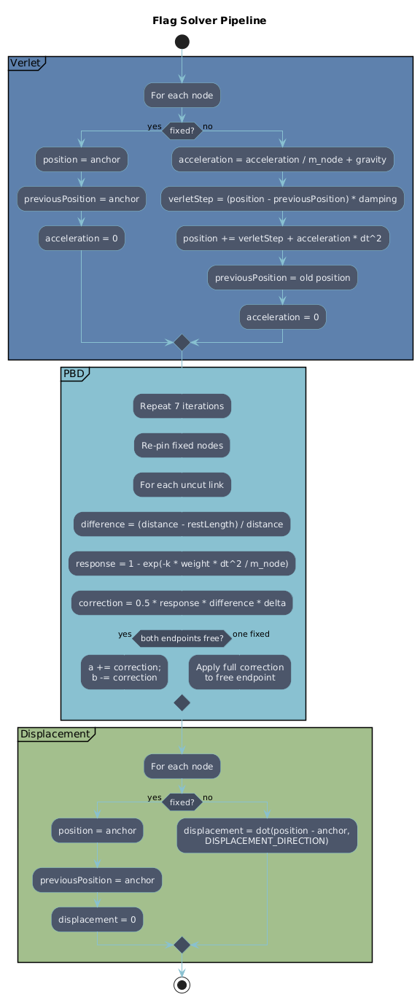

# PBD Flags

A small interactive Three.js study project for cloth-like flag motion using a Verlet integrator, PBD-style distance constraints, and a lightweight modal analysis overlay.

Live demo: https://jason9075.github.io/PBD-Flags/

## What It Does

This project visualizes a low-resolution flag lattice with:

- a `4 x 3` node grid
- pinned pole-side nodes
- Verlet position updates
- iterative PBD constraint projection
- wind, impulse, cut-link, and modal exploration controls

The app is meant to be read as much as it is meant to be used. The code keeps the simulation compact enough to inspect while still exposing the main moving parts of a cloth solver.

## Solver Pipeline

The core per-frame update is split into three phases:

1. `Verlet`: predict the next node positions from the previous positions, damping, gravity, and accumulated external forces.
2. `PBD`: run several rounds of distance-constraint correction across the link network. Each round uses a Gauss-Seidel style update — each link reads the positions already modified by earlier links in the same round — so constraints closer to the pole are satisfied first and the free tail accumulates the residual error.
3. `Displacement`: compute the final per-node displacement values used by the modal UI.



The diagram above summarizes the logic inside `updateNodeMotion()`. It is useful when reading the solver because the implementation is intentionally staged rather than collapsed into one loop.

## Project Structure

- `index.html`: app shell and UI layout
- `src/main.js`: simulation, rendering, controls, and modal logic
- `STUDY.md`: study notes explaining the math and modeling choices
- `assets/Pipeline.png`: high-level solver pipeline diagram

## Local Development

This repository is served as a static site.

```bash
nix develop
just dev
```

Then open `http://127.0.0.1:8080`.

Useful commands:

- `just dev`: start the local server
- `just refresh`: touch `index.html` to force a reload
- `just check`: print local tool versions

## Notes

- Gravity, mass, damping, drive force, and spring stiffness now use explicit engineering-style units in the UI.
- The cloth solver is still a compact teaching-oriented approximation, not a full FEM cloth simulation.
- The modal readout is a reduced model over the free-node displacement basis, intended as an interpretive tool rather than a full structural analysis package.
